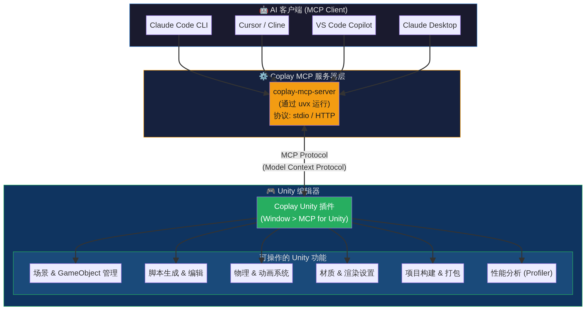
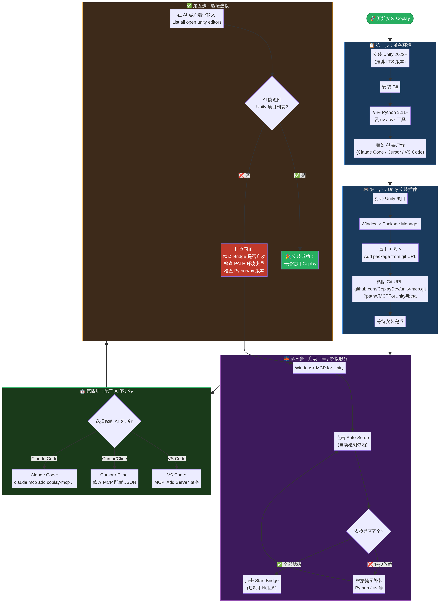

# Coplay (Unity + AI) 完整使用教程与最佳实践

> **Coplay** 是一款专为 Unity 游戏开发者设计的 AI 助手。通过 **MCP（Model Context Protocol，模型上下文协议）**，它能够将你常用的 AI 客户端（如 Claude Code、Cursor、VS Code、Gemini CLI 等）与 Unity 编辑器直接连接，让你用自然语言控制整个游戏开发工作流。

- **官方文档**：[coplaydev.github.io/unity-mcp](https://coplaydev.github.io/unity-mcp/)
- **GitHub 仓库**：[CoplayDev/unity-mcp](https://github.com/CoplayDev/unity-mcp)
- **当前最新版本**：**v10.0.0**（2026-06-30 发布）⬆️ *原文档版本为 v9.6.6，已大幅更新*
- **许可证**：MIT，完全免费开源

---

## 📋 版本更新历史（近期重要版本）

| 版本 | 发布日期 | 重点更新 |
|------|----------|----------|
| **[v10.0.0](https://github.com/CoplayDev/unity-mcp/releases/tag/v10.0.0)** | 2026-06-30 | 🆕 **AI 资产生成**（3D/2D）、品牌重塑、分发更新 |
| [v9.7.3](https://github.com/CoplayDev/unity-mcp/releases/tag/v9.7.3) | 2026-06-15 | Kimi Code CLI 支持、VisionOS 兼容修复、Memory Profiler 修复 |
| [v9.7.1](https://github.com/CoplayDev/unity-mcp/releases/tag/v9.7.1) | 2026-05-24 | Antigravity/Gemini CLI 迁移修复、文档改进 |
| [v9.7.0](https://github.com/CoplayDev/unity-mcp/releases/tag/v9.7.0) | 2026-05-22 | 一键客户端连接、UI Toolkit 截图修复、CI 测试矩阵增强 |
| [v9.6.4](https://github.com/CoplayDev/unity-mcp/releases/tag/v9.6.4) | 2026-03-31 | `manage_profiler`（性能分析工具）、Prefab Stage、物理管理工具 |
| [v9.6.5](https://github.com/CoplayDev/unity-mcp/releases/tag/v9.6.5) | 2026-04-03 | `execute_code` 工具（在 Editor 中执行任意 C#）、is_static 参数 |
| [v9.5.3](https://github.com/CoplayDev/unity-mcp/releases/tag/v9.5.3) | 2026-03-09 | `manage_graphics`、`manage_packages`、OpenClaw 支持 |
| [v9.5.2](https://github.com/CoplayDev/unity-mcp/releases/tag/v9.5.2) | 2026-03-07 | `manage_camera`（含 Cinemachine 支持） |
| [v9.4.8](https://github.com/CoplayDev/unity-mcp/releases/tag/v9.4.8) | 2026-03-06 | 全新 UI 系统、Gemini CLI/Qwen Code/GitHub Copilot 支持、多视角截图、Roslyn 安装器、ProBuilder 集成 |
| [v9.3.1](https://github.com/CoplayDev/unity-mcp/releases/tag/v9.3.1) | 2026-01-31 | 程序化纹理/Sprite 生成、远程服务器鉴权、Docker MCP 网关、CLI 工具 |

---

## 一、核心概念解析

在开始安装之前，先理清 Coplay 生态中的三个核心角色：

| 角色 | 是什么 | 作用 |
|------|--------|------|
| **Coplay Unity 插件** | 安装在 Unity 编辑器内部的包 | 接收指令，在 Unity 内执行操作（修改场景、创建脚本等） |
| **Coplay MCP 服务器** | 通过 `uvx` 运行的本地协议服务器 | 在 AI 客户端和 Unity 插件之间传递信息 |
| **AI 客户端** | Claude Code / Cursor / VS Code / Gemini CLI 等 | 你发出自然语言指令的地方 |

整个工作流可以理解为一条链路：

> **你的自然语言指令** → **AI 客户端** → **Coplay MCP 服务器** → **Unity 内部插件** → **Unity 执行操作**

### 系统架构示意图



---

## 二、安装前置准备

在开始安装之前，请确保以下环境已就绪：

| 依赖项 | 要求版本 | 说明 |
|--------|----------|------|
| **Unity Editor** | **2021.3 LTS → 6.x**（均支持） | Unity 2021.3 LTS 已被官方明确支持；推荐使用 Unity 2022+ LTS |
| **Git** | 任意版本 | 用于通过 URL 拉取 Unity 包，必须安装 |
| **Python** | **3.10 或更高**（推荐 3.11+） | v10 起最低要求从 3.11 降至 3.10 |
| **uv / uvx** | 最新版 | Python 包管理工具，用于启动 MCP 服务器 |
| **Node.js + npm** | 可选 | 如果你使用 Claude Code CLI，需要通过 npm 安装 |
| **AI 客户端** | 任意 | 见下方支持列表 |

### 已支持的 AI 客户端（v10.0.0）

Claude Code CLI · Claude Desktop · Cursor · VS Code / GitHub Copilot · Cline · Windsurf · Gemini CLI · Qwen Code · Kimi Code · OpenCode · OpenClaw

---

## 三、详细安装步骤

### 完整安装流程图



---

### 第一步：在 Unity 中安装 Coplay 插件

#### 方式 A：通过 Git URL 安装（推荐）

1. 打开你的 Unity 项目。
2. 在顶部菜单栏选择 **Window > Package Manager**。
3. 点击左上角的 **`+`** 号图标。
4. 选择 **Add package from git URL...**。
5. 粘贴以下链接，然后点击 **Add**：

   ```
   https://github.com/CoplayDev/unity-mcp.git?path=/MCPForUnity#main
   ```

   > 💡 **版本锁定**：如需固定到特定版本，将 `#main` 替换为 `#v10.0.0`（或其他版本号）。

6. 等待 Unity 下载并编译包（约需 1-2 分钟）。

#### 方式 B：通过 OpenUPM 安装（新增）

```bash
openupm add com.coplaydev.unity-mcp
```

#### 方式 C：Unity Asset Store

访问 [MCP for Unity on Asset Store](https://assetstore.unity.com/packages/tools/generative-ai/mcp-for-unity-ai-driven-development-329908) 安装。

---

### 第二步：在 Unity 中配置并启动 MCP 服务

安装完包后，**必须配置并启动桥接服务**，否则 AI 客户端无法连接到 Unity。

1. 在 Unity 顶部菜单栏选择 **Window > MCP for Unity**。
2. 在弹出的窗口中，点击 **Configure All Detected Clients**（v9.7.0+ 支持一键配置所有已检测到的客户端）。
3. 如果系统提示缺少 Python 或 uv 等依赖，请根据提示安装后重试。
4. 确认环境无误后，点击 **Start Bridge**（或 Start Server）。
5. 服务启动后，将在本地 `localhost:8080` 端口监听连接。

> ⚡ **v9.7.0 新特性**：支持"一键客户端连接"，无需手动编辑配置文件，窗口会自动检测并配置所有已安装的 MCP 兼容客户端。

---

### 第三步：在 AI 客户端中接入 Coplay MCP

根据你使用的 AI 客户端不同，配置方式也有所区别：

#### 方案 A：Claude Code CLI（推荐）

```bash
# 第一步：安装 Claude Code CLI（如果还没装）
npm install -g @anthropic-ai/claude-code

# 第二步：验证安装
claude --version

# 第三步：注册 Coplay MCP 服务器
claude mcp add --scope user --transport stdio coplay-mcp \
  --env MCP_TOOL_TIMEOUT=720000 \
  -- uvx --python ">=3.10" coplay-mcp-server@latest

# 第四步：查看已注册的 MCP 服务器列表
claude mcp list
```

> **注**：`MCP_TOOL_TIMEOUT=720000` 表示超时时间为 12 分钟（720,000 毫秒）。某些 Unity 任务（如光照烘焙、复杂构建）可能需要较长时间，因此官方建议设置此值。Python 版本要求已从 `>=3.11` 降至 `>=3.10`。

---

#### 方案 B：Claude Desktop

1. 打开 Claude Desktop 应用。
2. 进入 **Settings > Developer > Edit Config**，打开 `claude_desktop_config.json` 文件。
3. 添加以下配置：

   ```json
   {
     "mcpServers": {
       "coplay-mcp": {
         "command": "uvx",
         "args": ["--python", ">=3.10", "coplay-mcp-server@latest"],
         "env": {
           "MCP_TOOL_TIMEOUT": "720000"
         }
       }
     }
   }
   ```

4. 完全退出并重启 Claude Desktop。

---

#### 方案 C：Cursor / Cline / Windsurf

在 MCP 配置界面中添加以下 JSON 配置：

```json
{
  "mcpServers": {
    "coplay-mcp": {
      "autoApprove": [],
      "disabled": false,
      "timeout": 720,
      "type": "stdio",
      "command": "uvx",
      "args": ["--python", ">=3.10", "coplay-mcp-server@latest"]
    }
  }
}
```

---

#### 方案 D：VS Code / GitHub Copilot

1. 按下 `Ctrl/Cmd + Shift + P` 打开命令面板。
2. 输入并选择 **MCP: Add Server**。
3. 选择 **stdio** 作为传输方式。
4. 输入启动命令：`uvx --python >=3.10 coplay-mcp-server@latest`
5. 将标识名（Identifier）填写为：`coplay-mcp`

> 💡 **v9.3.1+ 新增**：VS Code 已被官方列为正式支持客户端，GitHub Copilot CLI 集成由 @GeekTrainer 贡献。

---

#### 方案 E：Gemini CLI（新增 v9.4.8+）

在 Unity 窗口中点击 **Configure All Detected Clients** 后，Gemini CLI 会被自动检测和配置（需确保 Gemini CLI 已安装并完成 2.x 迁移）。

---

#### 方案 F：Kimi Code CLI（新增 v9.7.3+）

```json
{
  "mcpServers": {
    "coplay-mcp": {
      "command": "uvx",
      "args": ["--python", ">=3.10", "coplay-mcp-server@latest"],
      "env": {
        "MCP_TOOL_TIMEOUT": "720000"
      }
    }
  }
}
```

---

## 四、测试与验证

完成所有步骤后，在你的 AI 客户端聊天窗口中输入以下提示词来验证连接：

```
List all of the open unity editors using Coplay MCP
```

如果 AI 能够准确返回你当前正在运行的 Unity 项目名称和状态，说明整个链路已经打通，安装成功！

---

## 五、常见避坑指南

| 问题 | 原因 | 解决方案 |
|------|------|----------|
| Git URL 安装失败 | 官方在不同时期提供过多个 URL | 优先使用 `unity-mcp.git?path=/MCPForUnity#main`（v10 已切换到 main 分支） |
| AI 连不上 Unity | 忘记启动 Bridge 服务 | 打开 **Window > MCP for Unity**，确认 Bridge 已启动 |
| `claude` 命令找不到 | 环境变量（PATH）未刷新 | 重启终端，或手动将 npm 全局包路径加入 PATH |
| Python / uv 缺失 | 未安装必要依赖 | 安装 Python 3.10+ 和 uv，确保在终端中可用 |
| Unity 版本太旧 | 2021 以下版本兼容性差 | 升级到 Unity 2021.3 LTS 或更高版本 |
| 任务超时 | 默认超时时间过短 | 设置 `MCP_TOOL_TIMEOUT=720000`（12 分钟） |
| macOS pyenv 路径问题 | pyenv shims 不在 PATH 中 | 已在 v9.4.8+ 修复，升级插件即可 |
| VisionOS 编译错误 | 编译时引用了 VisionOS 枚举 | 已在 v9.7.3 修复 |
| stdio 端口绑定竞态 | 多实例启动时端口冲突 | 已在 v9.7.3 修复（自动重试同一端口） |
| 截图未包含 UI Toolkit | UI Toolkit Overlay 层未捕获 | 已在 v9.7.0 修复 |

---

## 六、Coplay 的强大能力与应用场景

连接成功后，你可以用自然语言让 AI 帮你完成各种 Unity 开发任务。以下是 Coplay 支持的主要工具分类（**v10.0.0 共 47 个 MCP 工具入口**）：

| 工具分类 | 代表工具 | 能做什么 |
|----------|----------|----------|
| **场景管理** | `manage_scene`, `manage_gameobject` | 创建/删除/查找 GameObject，多场景编辑 |
| **脚本操作** | `create_script`, `manage_script`, `validate_script` | 生成 C# 脚本，修改代码，Roslyn 静态验证 |
| **代码执行** | `execute_code` ⭐ *v9.6.5 新增* | 在 Unity Editor 中运行任意 C# 代码片段 |
| **物理系统** | `manage_physics` ⭐ *v9.6.4 新增* | 配置刚体、碰撞体、关节，执行射线检测 |
| **动画系统** | `manage_animation` | 管理 Animator Controller 和动画片段 |
| **渲染与材质** | `manage_material`, `manage_graphics`, `manage_shader` | 修改材质、调整后处理、URP 设置 |
| **摄像机** | `manage_camera` ⭐ *v9.5.2 新增* | 管理摄像机，支持 Cinemachine，Scene View 截图 |
| **UI 系统** | `manage_ui` | 创建和管理 Canvas、UI 元素 |
| **Prefab** | `manage_prefabs` | 完整 Prefab Stage 工作流，headless 内容修改 |
| **项目构建** | `manage_build` | 多平台打包，配置 Player Settings |
| **性能分析** | `manage_profiler` ⭐ *v9.6.4 新增* | 启动 Profiler，获取内存快照、帧时间、Frame Debugger |
| **包管理** | `manage_packages` ⭐ *v9.5.3 新增* | 安装/删除 Unity 包，管理依赖 |
| **AI 资产生成** | `asset_generation` 🆕 *v10.0.0 新增* | AI 生成 3D 模型（导入）+ 2D 图像（需自备 API Key） |
| **纹理生成** | `manage_texture` | 修改纹理设置，程序化 Sprite/Texture2D 生成 |
| **文档与反射** | `unity_docs`, `unity_reflect` | 查询 Unity 官方文档，反射检查 C# API |
| **项目工具** | `manage_editor` | 打开 Prefab Stage，保存场景，管理编辑器状态 |

### 实战提示词示例

以下是一些可以直接在 AI 客户端中使用的提示词，感受 Coplay 的强大之处：

```
# 场景操作
在场景中创建一个红色的立方体，并给它添加一个 Rigidbody 组件。

# 脚本生成
帮我写一个 FPS 玩家控制器脚本，实现 WASD 移动、鼠标视角控制和空格键跳跃，并挂载到名为 'Player' 的对象上。

# 性能优化
启动 Profiler，运行 5 秒后获取内存快照，告诉我哪些对象占用内存最多。

# 项目构建
切换到 Android 平台，将 Bundle Identifier 设置为 com.mycompany.mygame，然后触发一次构建。

# 场景检查
检查当前场景中所有的 Collider，找出没有分配物理材质（Physics Material）的对象。

# 执行任意 C#（v9.6.5+ 新增）
在 Editor 中执行以下代码：统计场景内所有 MeshRenderer 的三角面总数，并打印到 Console。

# AI 资产生成（v10.0.0 新增）
用 AI 生成一个低多边形风格的树模型并导入到项目中。
```

---

## 七、进阶功能

### 多 Unity 实例路由

同时控制多个 Unity 项目：每个工具调用可通过 `unity_instance` 参数指定目标实例。
详见：[Multi-Instance Routing](https://coplaydev.github.io/unity-mcp/guides/multi-instance)

### 工具分组（Tool Groups）

按需启用/禁用工具组（vfx / animation / ui / testing 等），减少 AI 上下文消耗：
详见：[Tool Groups](https://coplaydev.github.io/unity-mcp/guides/tool-groups)

### 远程服务器鉴权

支持将 MCP 服务器部署到远端，通过 OAuth 鉴权连接：
详见：[Remote Server Auth](https://coplaydev.github.io/unity-mcp/guides/remote-server-auth)

### Docker MCP 网关

通过 Docker 运行 MCP 服务器，适合 CI/CD 场景：参考 [v9.1.0 发布说明](https://github.com/CoplayDev/unity-mcp/releases/tag/v9.1.0)

### Roslyn 脚本验证

基于 Roslyn 编译器的静态代码验证，在脚本写入 Unity 之前提前发现错误：
详见：[Roslyn Validation](https://coplaydev.github.io/unity-mcp/guides/roslyn)

### v10 升级迁移指南

从 v9.x 升级到 v10 有资产生成相关的变更：
详见：[v10 Migration](https://coplaydev.github.io/unity-mcp/migrations/v10)

---

## 八、参考资料

- [Coplay 官方文档 & Wiki](https://coplaydev.github.io/unity-mcp/)
- [CoplayDev/unity-mcp GitHub 仓库](https://github.com/CoplayDev/unity-mcp)
- [完整工具目录](https://coplaydev.github.io/unity-mcp/reference/tools/)
- [Release Notes（完整版本历史）](https://coplaydev.github.io/unity-mcp/releases)
- [MCP for Unity on Unity Asset Store](https://assetstore.unity.com/packages/tools/generative-ai/mcp-for-unity-ai-driven-development-329908)
- [Model Context Protocol 官方规范](https://modelcontextprotocol.io)
- [Discord 社区](https://discord.gg/y4p8KfzrN4)
- [Aura for Unity（付费 AI 助手）](https://www.tryaura.dev/)

---

*本文档基于 CoplayDev/unity-mcp 官方发布记录整理，当前版本对应 **v10.0.0**（2026-06-30）。如有更新，请参考 [官方文档](https://coplaydev.github.io/unity-mcp/) 或 [GitHub Releases](https://github.com/CoplayDev/unity-mcp/releases)。*
